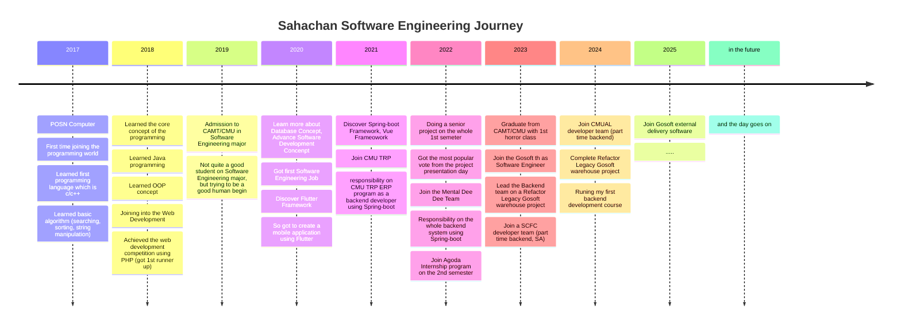

### Hi there I'm Oat (Oralita) 🌷

- ⚒  A Software Engineer (mostly working on backend, database, system analysis and architecture design) 
- 🔭 I’m currently working fulltimes as a `software engineer` (backend system)
- 🔫 I completed my university with this [senior project](https://github.com/Transmatter) which helping viusal impaired access to the internet contents uging our designed ux pattern.
- ⚡ Fun fact: I really love medium roast espresso ☕ and standard matcha 🍵
- 🎓 Graduate from CMU/CAMT in SE major (Graduate Year: 2023)
- ✏ now I am learning and practicing

``` 

  🛠 Microservice Developement, ⚓ DevOps, 🎨 UI, 📝 UX,
  
  🧹 Clean code & Clean architecture, 🧪 testing & qa, 🟫 AWS
  
  🌵 Flexible Software Design, 🗄️ database, 🔢 discrete math

  🌎 project management, 🟦 kafka
  
```

### My skill 🤹‍♀️

#### Hard skill 🛠

| skill | list |
|-------|------|
| Frontend |     |
| Backend |  |
| DevOps |     |
| Database |   |

#### Soft skill 👨‍🎨

```

📃 Origami, 🧛‍♂️ Fantasy story teller, ❓ Questioning, 

🎶 Indy Music Listener, 🎼 Alternative Rock Music Listener,

🎭 Meme Enjoyer, ⚖ Politics Talking, 

🐱‍🏍 Dank Story Talking, ☕ Coffee enjoyer, 📜 Explainer

💸 Caplitalism Realization, 🎃 Existentialism Thinker

```

#### Here my fake trophy that look nice 🏆


#### And here my daily Status 🐾


#### My favorite quote


#### Software Engineering Journey



#### Nice to meet ya 🤗
---


